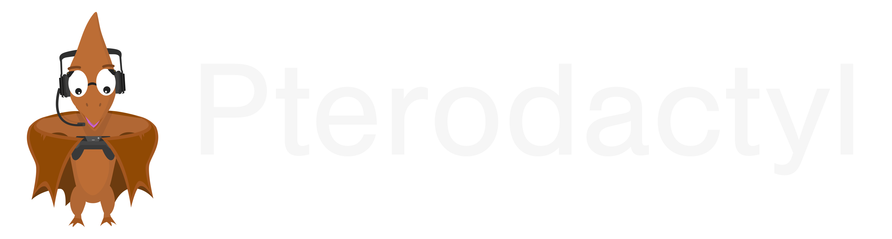

# Infra Services : Pterodactyl



## Table Of Contents

- [Infra Services : Pterodactyl](#infra-services--pterodactyl)
  - [Table Of Contents](#table-of-contents)
  - [Description](#description)
  - [Resources](#resources)
  - [Install](#install)
  - [Configure](#configure)
  - [Setup New Game Server](#setup-new-game-server)

## Description

[Pterodactyl](https://pterodactyl.io/) is a **free** and **Open Source** Game Server Management Panel, with it, you can run all **game server** you want into **Docker containers** and manage them in **beautiful Web UI**.

## Resources

- [Documentations](https://pterodactyl.io/project/introduction.html)
- [Auto Script](https://github.com/vilhelmprytz/pterodactyl-installer)

## Install

The simpliest and best way to install Pterodactyl is with the Auto Install Script :

```bash
# Go in Root
sudo -s

# Download and Launch the Script
bash <(curl -s https://pterodactyl-installer.se)

# Panel Install
> 2 (Wings and Panel)
> Database Name : panel
> Database Username : pterodactyl
> Password : Random
> Timezone : Europe/Paris
> Domain Email
> Admin Email Account : admin@mail.net
> Admin Username : admin
> Admin First Name : admin
> Admin Last Name : 42
> Admin Password : Your Password
> FQDN : IP address or Domain name
> Firewall UFW : y
> Lets Encrypt : As you wish
> Install : y

# Wings Install
> Auto Configure UFW : y
> Auto Config User for database : y
> Configure MySQL to be accessed externally : N
> Database Username : pterodactyluser
> Database Password : Your Password
> Lets Encrypt : As you wish
> Install : y

systemctl enable wings
systemctl start wings
systemctl status wings
```

## Configure

Now you have to configure your server :

1) First Connect to your Pterodactyl Panel
2) Go to Admin Management
3) Go to Locations to configure the locations of your servers
4) Create a new locations with the name of your current server

## Setup New Game Server

Finally, your server is ready, you can setup your first Game server :

1) TODO
